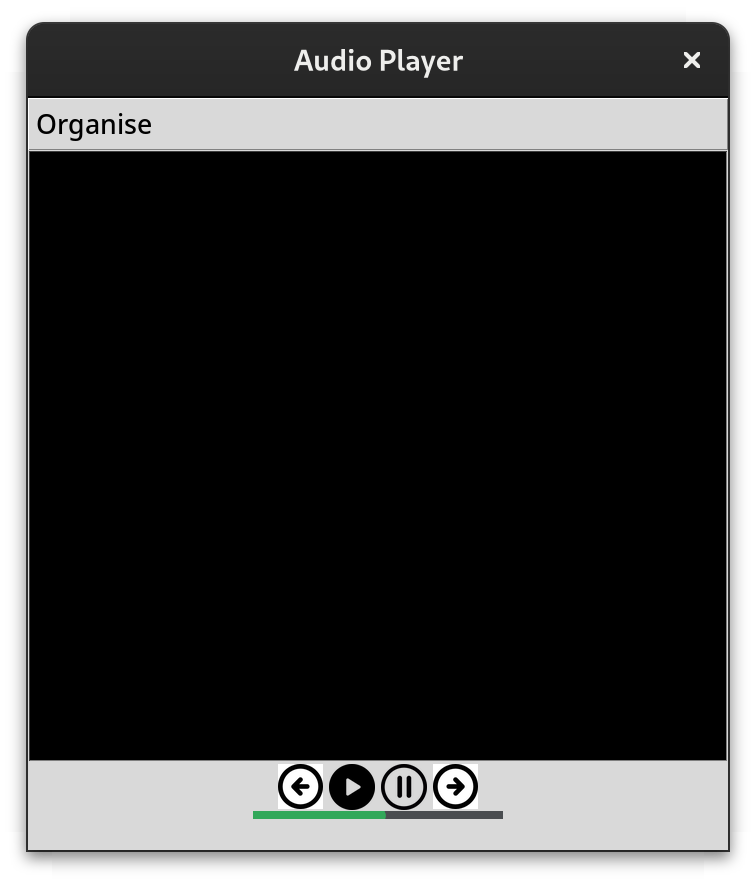
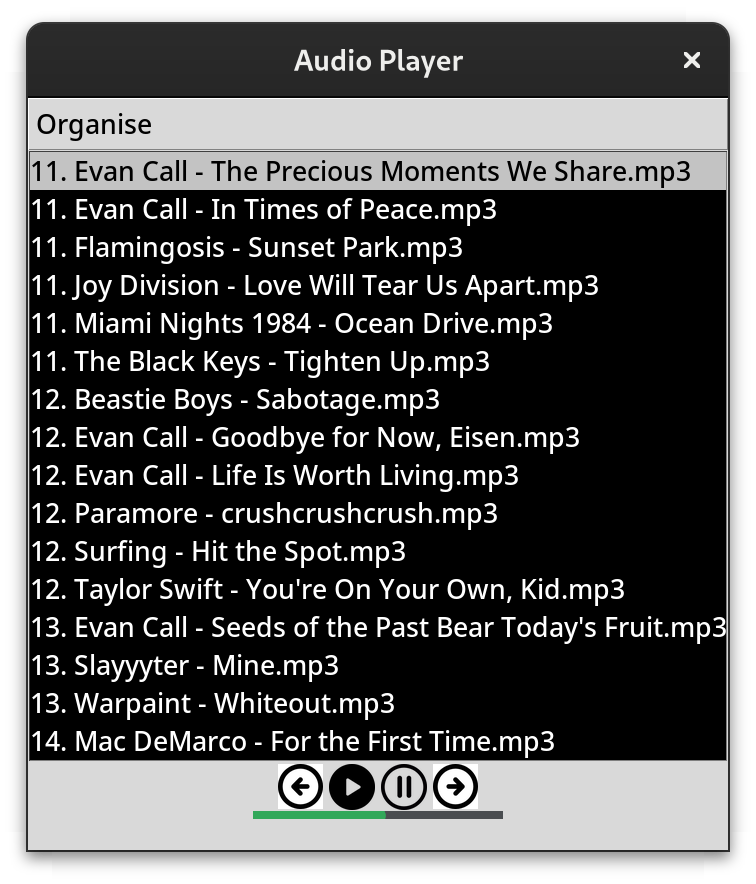

# Music Player Project 
Audio file player application. Can run mp3, WAV and OGG files. 
 

   

## About
Originally I started making this Music player for myself as I was using Fedora Linux, which at the time I thought had no default proper audio file player. Since then I have found that there are indeed good applications for this on Fedora. Regardless I had decided to complete this project (so it plays music) as I was enjoying building it and the prospect of having my own personal music player app, which I now do.

## Features
- Pause
- Play
- Previous Track
- Next Track
- Clicking on any track listed in the black listbox will play that track

## Setup
Install the source code and "Images" folder (with images) and make sure both items are in the same folder. Make you sure you have python installed and then run the code in any IDE.

## Usage
Click the Organize button, another window will pop up allowing you to choose a folder with audio files in it. Make sure the filepath shown is correct before clicking Ok. Now you can play and pause the audio with the corresponding buttons and go to the previous track, or next track, by using the left and right arrow buttons respectively. You may also click on any file name in the application to start playing it. 

## Challenges and Lessons Learned

## Future Improvements
- Automatically play the next track when the current track finishes playing.
- A shuffle button/mode where to change up the track order.
- Change to a distributable package.
Currently I am satisfied that my music player just works and plays audio files as is.
At the moment there are other projects I would like to work on, however I would like to implement at least one of the features soon.